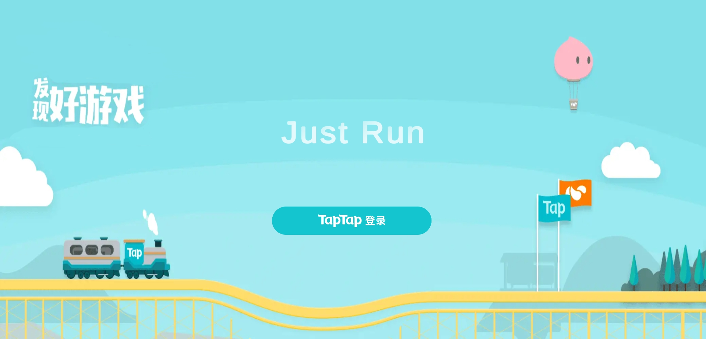
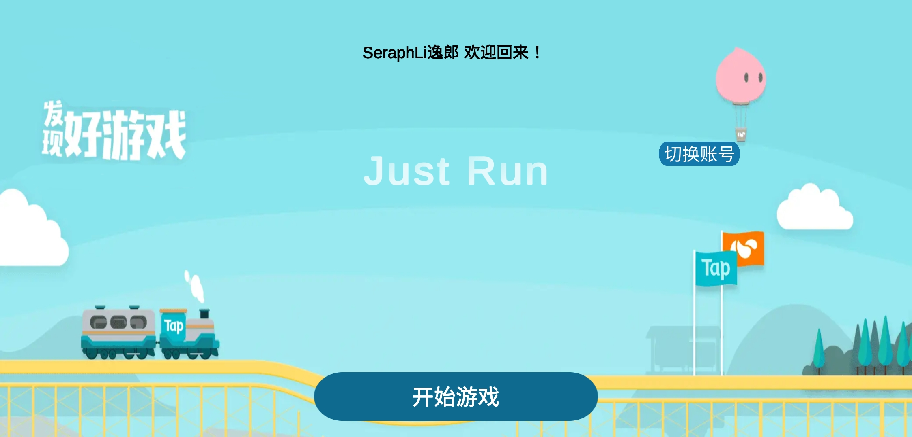
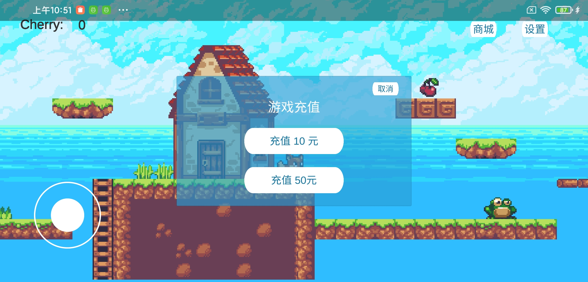
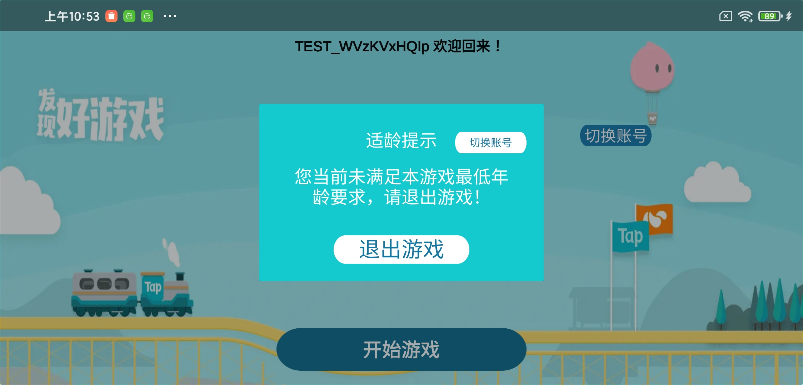

# TDS-Unity-Demo

## 介绍
当前项目是 TDS Unity 游戏演示 Demo，支持 PC 和移动平台，开发者测试时需替换项目中 `clientID` 为在 TapTap 开发者中心已申请的 `Client ID`，同时包名和签名也应和 Tap 登录中配置的信息保持一致。

## 已集成的 TDS 功能
* TapTap 登录
* 合规认证

## 游戏截图示例

* 登录页面

* 登录后的用户中心页面，展示用户昵称、切换账号和开始游戏按钮

* 合规认证检查支付示例

* 触发适龄限制示例

